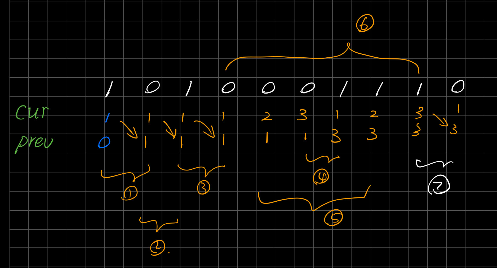

# [696] Count Binary Substrings

## Description

[LeetCode Problem Description](https://leetcode.com/problems/count-binary-substrings/description/)

* algorithms
* Easy (52.08%)
* Testcase Example:  '"00110"'

```md
Give a string s, count the number of non-empty (contiguous) substrings that have the same number of 0's and 1's, and all the 0's and all the 1's in these substrings are grouped consecutively.
Substrings that occur multiple times are counted the number of times they occur.
Example 1:
Input: "00110011"
Output: 6
Explanation: There are 6 substrings that have equal number of consecutive 1's and 0's: "0011", "01", "1100", "10", "0011", and "01".
Notice that some of these substrings repeat and are counted the number of times they occur.
Also, "00110011" is not a valid substring because all the 0's (and 1's) are not grouped together.
Example 2:
Input: "10101"
Output: 4
Explanation: There are 4 substrings: "10", "01", "10", "01" that have equal number of consecutive 1's and 0's.
Note:
s.length will be between 1 and 50,000.
s will only consist of "0" or "1" characters.

```

## Solution

LEETCODE 上一个很有意思的解决方案:

curLength means the consecutive length of cur number, i.e., s[i],



[SourceCode](./solution.js)